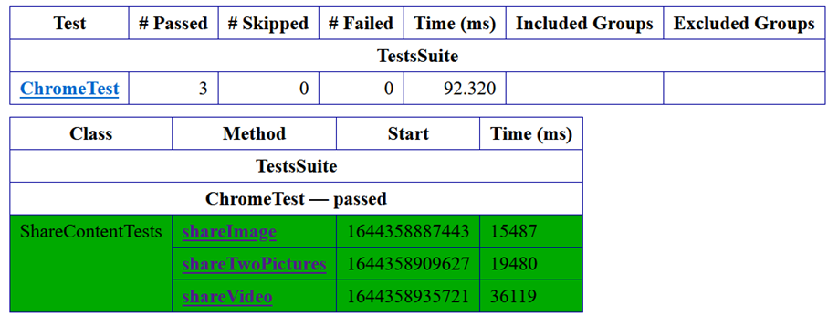
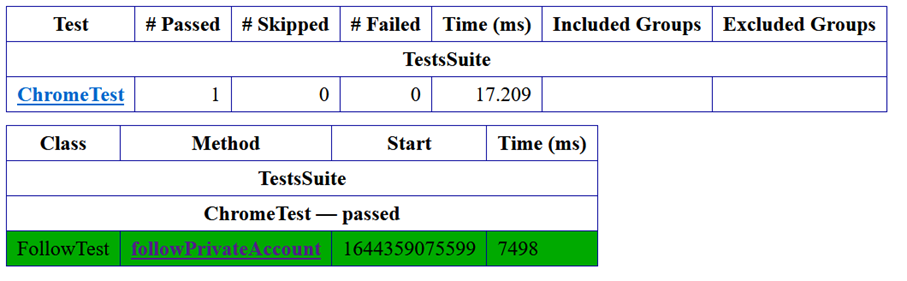

# Automated testing for Instagram web app
 
This project is created for the assignment at ***Methods and Techinques of Software Testing*** course at FERIT Osijek. 
In this project, automation testing was implemented for Web application Instagram.
Instagram is a social app and it has a lot of functionalities, like share content, send message, follow other user, watch content and many more.
Instagram account is created for the purposes of this project.
Functionalities tested in this project:
 1. Login functionality
 2. Share image/video functionality
 3. Follow functionality

- Project is created in IntelliJ Community Edition
- It is a Maven project
- Tests are runed using TestNG
- To drive the browsers I used Selenium WebDriver 

## Tools that you need to install for running this project

 1. Java JDK (https://www.oracle.com/java/technologies/downloads/#java8)
 2. IntelliJ (https://www.jetbrains.com/idea/download/#section=windows)
 
 ## Opening the project in IntelliJ
 1. Run IntelliJ
 2. File -> Open
 3. Navigate to the project file, select projektniZadatakMTTPP and click OK button

## Configuration
  Before running the tests:
  - choose browser/browsers in which you want to run them (Chrome, Edge or Firefox)
  - choose which test classes you want to run
  - modify ***testng.xml*** according to decisions

## How to run the tests
There are two options:
1. Right click on ***testng.xml*** and chose ***Run***
2. Write in terminal: mvn test
   (Ctrl + Enter)

## Tests explanations

 There is a 10 tests in total.
 For finding elements I mostly used xpath because there were no id or name attributes and that can led to a problem if they chages.
 For every test class, I decided to show the test results gotten by running the tests in Chrome.

  ### LogInTests class

 In this class I tested log in functionality in 3 different ways:
  1. Entered correct username and password
  2. Entered wrong username and correct password
  3. Entered correct username and wrong password

 **Preconditions:**
  1. Internet connection
  2. Opened Instagram web site

 **Results**
  - Tests are passing, but sometime they don't because we cannot connect with Instagram to check entered data and because Instagram (after a lot of times that we logged in)         doesn't allowes as to log in the system and not giving appropriate alert in tests.
  
  

### AddContentTests class

In this class I tested one important functionality thah is included into sharing functionality, and that is
adding/choosing content for sharing. If this functionality doesn't work we cannot procide to sharing functionality.
Functionality is tested in 3 different ways:
1. Add one picture 
2. Add one video 
3. Add one more picture after one before

**Preconditions:**
1. Internet connection
2. User logged in

For this tests I had to find a way how to automatically choose content from computer.
I solve that problem by using package java.awt which enabled automatic key pressing/releasing, saving text to clipboard and a lot of other stuff but those are the most important ones for automatical content chosing (path to the content is saved on clipboard then it is pasted and enter is pressed -> this will select wanted content and then it is going to be shown in Instagram window ***Style***)

**Results**
 - Tests are passing, but sometime they don't because of logging issue, automation choosing not working (rarely).

### ShareContentTests class

In this class I tested sharing functionality in 3 different ways:
1. Share one picture
2. Share one video
3. Share two pictures

**Preconditions:**
1. Internet connection
2. User logged in
3. Content for sharing added 
 
**Results**
 - Tests are passing, but sometime they don't because of the same issues that I mentioned for class AddContentTests.

### FollowTest class

In this class I tested follow functionality.
For this functionality I wrote just one test:
1. Follow private account

**Preconditions:**
1. Internet connection
2. User logged in
3. User not already following account

**Results**
 - Tests are passing, but sometimes they don't because of logging issue.

